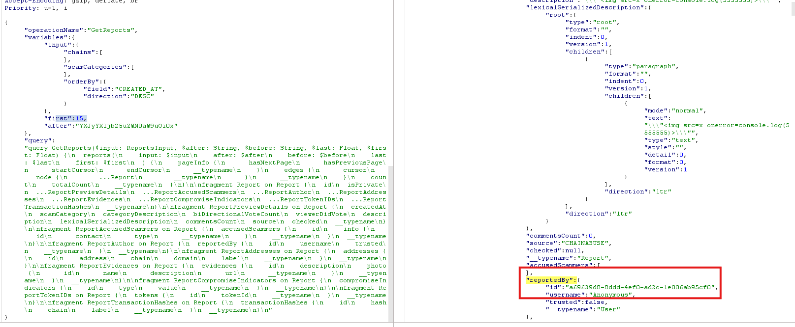
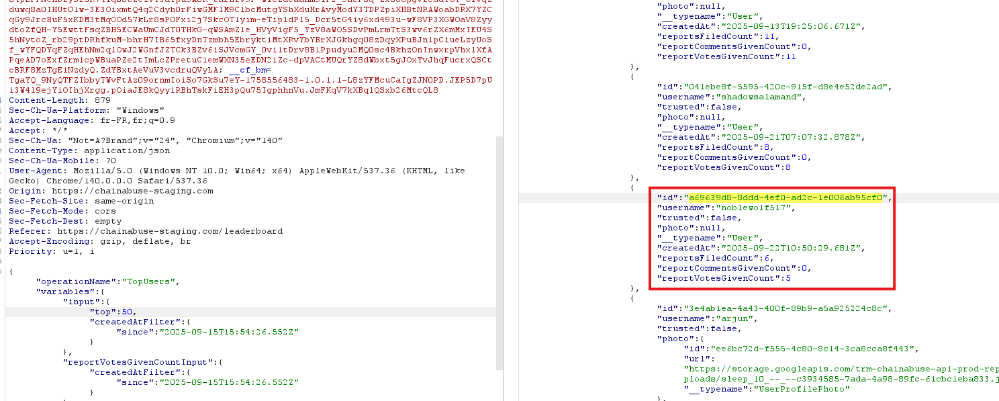
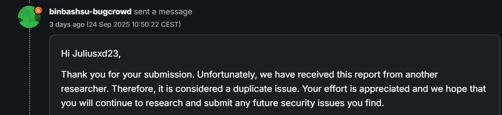

# Chainabuse P4 Broken Access Control result to De-anonymizing of author

## Map WebSite
Before attacking a site, you must understand the access points, the paths, and the normal functioning of the site. Here we are talking about a De-anonymizing of information that is hidden even for people who are connected. In this case, chainabuse uses GraphQL as the API engine. This is very convenient, because we see the entire process and the expected results for each request.
Use BurpSuite, navigate to the different pages then use the BurpSuite history to reread the different requests and see the interesting points.

## Exploit
Filter BurpSuite History for places where ```id```, ```uuid```, ```guid``` or ```userid``` appear.
Here I found 2 graphql queries which have a link :
- ```GetReports``` which results of 15 reports with ```username: Anonymous``` and ```id:```
- ```TopUsers``` which give us correspondences between ```id``` and ```username```

First, we list the reports and check that the IDs even marked as anonymous are different. This indicates that ```Anonymous``` is not an account in itself and does not have its own ID. We retrieve an ```id``` from ```GetReports```, we launch the ```TopUsers``` query and we look for the retrieved ```id``` in the ```TopUsers``` results. Here we can see that we are "stuck" at ```15 results```, but by modifying the query, the site accepts up to ```50```, which gives us a better chance of finding a match.

Image to illustrate:

First ```GetReports```:


Then ```TopUsers```:


## Duplicate
Unfortunately, even though the program was recent, someone had already postponed this BAC. So it ended up as a Duplicate.


## Disclaimer
Only meant for educational & ethical pentesting/bug hunting purposes with permission. You are responsible for your actions!