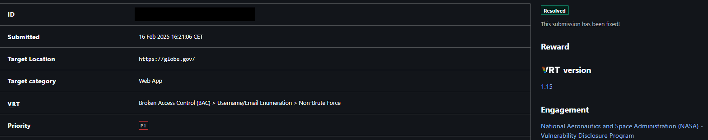
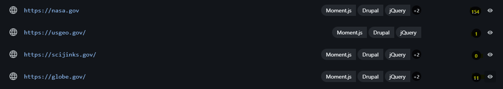
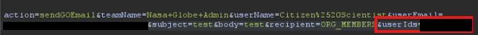
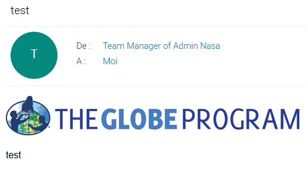
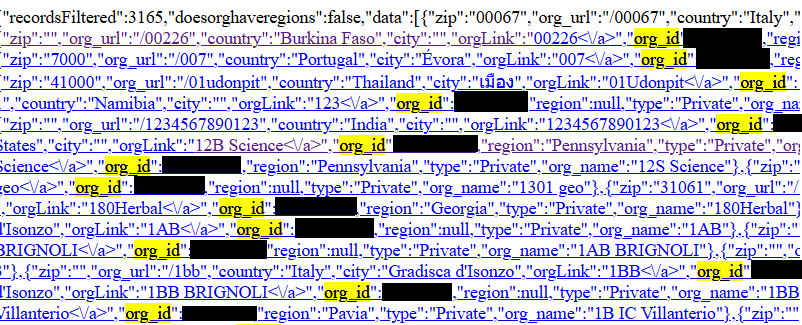
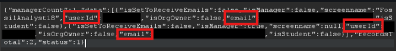
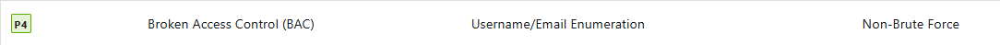
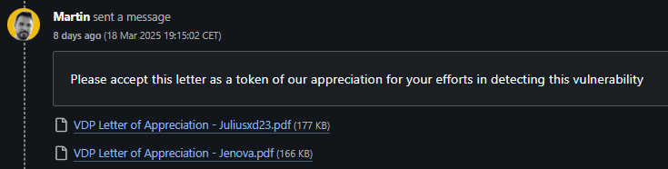
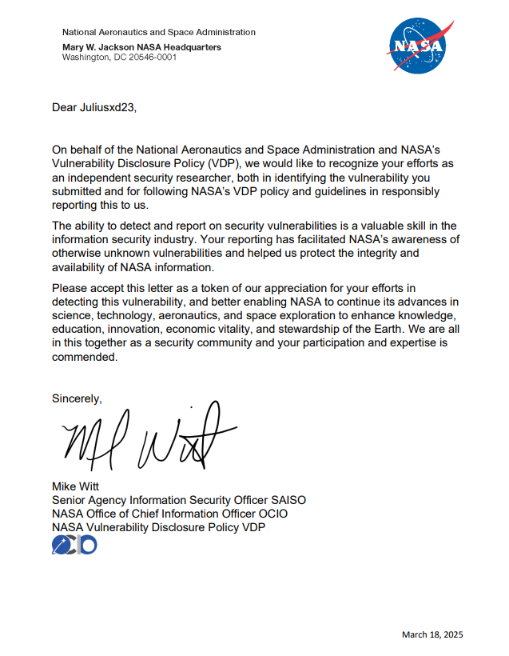

# Nasa P1 Broken Access Control result to Sensitive Information Retrieve

## Report Information

## Why start by Nasa Program ?
NASA is a world-renowned entity, it does not pay $$$ for bugs found, but instead sends a letter of recognition signed by NASA. As a beginner in bug bounty, my biggest fear was that I would lose motivation over time if I couldn't find a bug. The choice of the program is very important and NASA seemed to me the best option to start, even if the number of vulnerabilities already found is large (more than 7300 at the time of writing), bug bounty hunters does not stay long on this program, since it does not pay, once the letter of recognition is received, people leave for other programs. This then leaves the field open for newcomers to try to prove themselves. The large number of vulnerabilities also gives a significant indication that the areas in scope change often, which allows the playing field to be renewed with new bugs just waiting to be found :) And above all, as a child I loved space and the mysteries surrounding it, being able to imagine that years later, with my knowledge I could contribute in my own way to help NASA to continue to make discoveries and receive a letter of recognition for this. That's all I needed to motivate me !

## Step 1 : Discovering the program and definition of the objective
Before diving into research, there are several things to understand, especially as a beginner. Each program has its own unique way of working. You have to read everything several times, to fully understand the issues of the program, the areas that make up the scope, what can be done, what is prohibited, the guidelines, the information to be provided in the report, what type of bug is accepted and which are refused. This information is important to define the strategy that we will adopt and to define the objective, here as said above, my goal is to have at least 1 valid bug, which respects the criteria for obtaining the Lor !
To obtain it, I must report a vulnerability with a severity between P1 (Critical) and P4 (Low). If it is categorized as P5 (Informative), it is not eligible for the Lor.

| Priority | Severity    |
| -------- | ----------- |
| P1       | Critical    |
| P2       | High        |
| P3       | Medium      |
| P4       | Low         |
| P5       | Informative |

For this hunt, I will adopt the following strategy :
1. Choose a domain that has little recent Bug Report
2. Focus on one domain and not spread myself too thin
3. Don't use an automated tool, I want to find it by myself
4. Focus only on bugs rated as least P4 

To help us know the severity of each bug, Bugcrowd provides us with this correspondence table :
https://bugcrowd.com/vulnerability-rating-taxonomy/

## Step 2 : Discovery of domains and choice of target
Now that the project is defined, I need to choose which of the domains with little recent Bug Report, has the most functionality and therefore the most chance of having a flaw.
For this I invited a friend ([Jenova](https://www.linkedin.com/in/lionel-miceli/)) to join me in this NASA bug hunt. For him too, it's his first bug bounty and he aspires to become a pentester, this hunt will be profitable for both of us. And it's more fun to do it with friends.
As we can see in this capture, there are 3 domains that seem less tested :

After exploring all three domains, we chose to focus on "globe.gov," even though it has more reports to its credit. To briefly define the site, it's a hub for research and observation communities to aggregate data.

## Step 3 : Exploration and Bug
Now that our target is chosen, in order not to start chaotic research, we have chosen to put ourselves in the shoes of an ordinary researcher wishing to share an observation. To do this, we created an account, created a research group and explored different options available to us. We did this with an open BurpSuite to have a history of the requests and then see if any interesting information is present.
One feature caught our eye. As a research group leader, it is possible to send an email to members by selecting the members by checking the box in front of the member's name. If we can choose the members to whom to send the email, there is necessarily a moment information on the recipients. Let's do a test, look at the history on burpsuite and bingo! In the request there are the IDs of the members to whom to send the email. It is interesting to see that we can modify the name that will appear in the email, the subject and the body of the email.

To test this setting, we create a third account, not part of the research group. To check if we can send emails to people outside the group. To do this, we retrieve the account ID, we redo the actions to send an email but this time we use the burpsuite proxy to modify the request by adding after the legitimate ID ",12345678" where 12345678 is the ID of ​​our 3rd account. Bingo ! The 3rd account receives the email even though it is not part of the research group.

This behavior indicates that the site trusts the data sent by the browser without checking on the backend side, which is a very bad practice. This discovery could allow a person with the intention of phishing via NASA's email. This might be enough as a return, but without a way to retrieve the IDs of other accounts, it could be rated as P5. This is something we want to avoid. That's why we started looking for a way to find the IDs of other accounts. To do this, we searched in Burpsuite history to see if other pages had the "userId" parameter. Bingo, we found a URL, which from an org_id (the ID of the research group) gives not only the IDs of the accounts belonging to the group but also the emails used by the account ! The "org_ids" are easily found from the research groups listing.

From that point on, we knew we had found a P4 : Username/Email Enumeration without brute force ! It is at the limit for the Lor but we also have an exploitation of the information with a functionality of the site, which might potentially lead to an increase of the severity.

## Step 4 : Time for Submission
Now that we have exploited our findings as much as possible, we will be able to submit our work to Bugcrowd, once they have validated it, it can be transmitted to the NASA team to be fixed :)
For this we have divided our report into 5 parts :
- Description : One sentence to quickly describe the flaw 
- Business Impact : The goal here is to give the risks incurred due to this flaw
- Steps to reproduce : A series of quick steps with query and photo showing the path to follow to reproduce the exploitation
- Video Proof of concept (Poc) : A PoC video to prove that the flaw is indeed exploitable in case our explanations were not precise enough
- Conclusion : A quick summary including the severity of the flaw, the ease of exploitation and the major risks involved

Don't hesitate to take the time to write the report. In our case, it took as long as finding the vulnerability. But we did well, all that time allowed us to reassess the vulnerability from P4 to P1 !

Validating and fixing the vulnerability can take a long time and it is normal to not have any news.
Here's the timeline of our report :
- [16/02/2025] Submission of the report on BugCrowd
- [17/02/2025] Escalation of the severity to P1 and change the status to Triaged
- [21/02/2025] Nasa changed the status to Unresolved
- [18/03/2025] BugCrowd changed the status to Resolved
- [18/03/2025] Nasa sent us our Letter of Recognition (Lor)

## Conclusion

To conclude, here is a summary of the information :
- Find a goal to achieve
- Find a site and program that matches your goal
- Take the time to carefully read the program 2-3 times
- Take the time to browse the different areas in the scope
- Choose and focus on one domain
- Before attempting to hunt the site, take the time to explore it and understand how the available features work
- Keep a history of pages browsed to perhaps find links later
- Don't rush when you find something, it could be a piece of the puzzle to escalate a minor flaw to a critical flaw
- Take the time to write your report
- All you have to do now is wait for the notifications :)

## Letter of Recognition (Lor)

