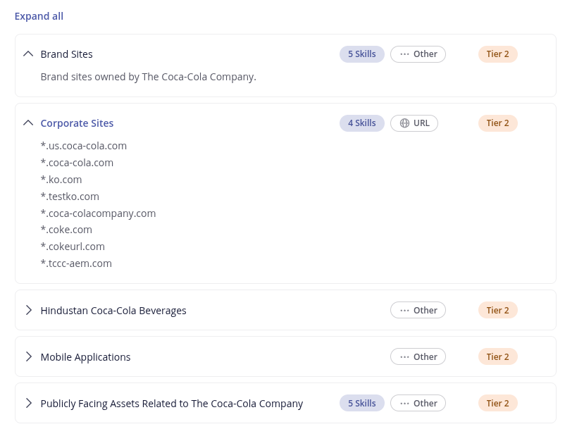
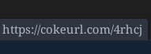
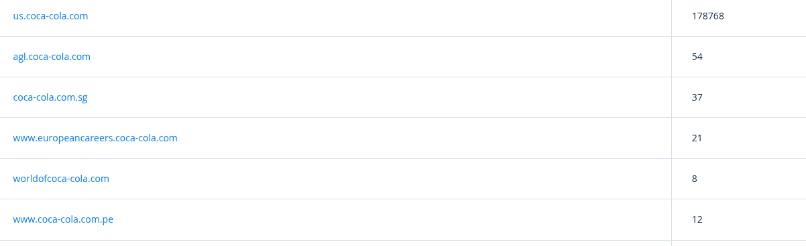
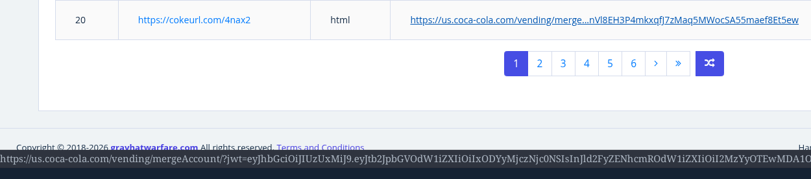
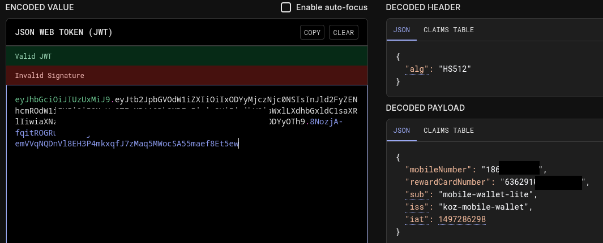
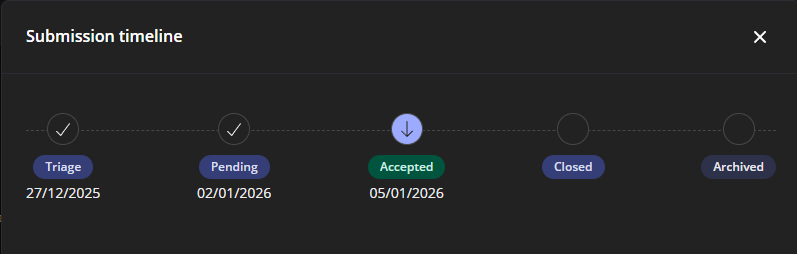
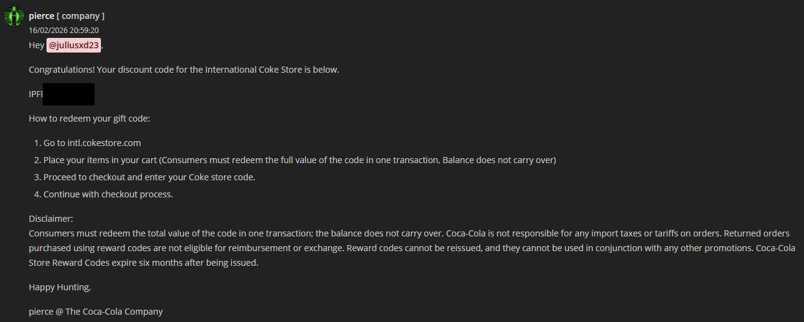

# Coca-Cola P3 Sensitive Data Exposure

## Step 1 : Discovering the program and definition of the objective
Coca-Cola's bug bounty program is a VDP (Vulnerability Disclosure Program). Instead of being paid to report security flaws, we are awarded with goodies, exclusive merch, .... Coca-Cola's VDP awards a voucher coupon for their online store. The voucher amount is linked to the severity of the security flaw like this:

| Priority | Severity     | Amount  |
| -------- | ------------ | ------- |
| P0       | Exceptional | $250    |
| P1       | Critical     | $150    |
| P2       | High         | $100    |
| P3       | Medium       | $50     |
| P4       | Low          | $25     |
| P5       | Informative  | $0      |

## Step 2 : Discovery of domains and choice of target
On Intigriti, compared to Bugcrowd, we don't see the number of reports relative to the domain. Coca-Cola's scope is wide.



I'm here to hunt on Coca-Cola, so focus first on the scope in the ```Corporate Sites``` area.
I'm curious about this scope ```*.cokeurl.com```. What could be the utility of this scope ending in ```url```? It is my first target.

## Step 3 : Exploration and Bug
Quick Google Dork to try to understand the utility of this domain: ```site:cokeurl.com```. Many results wih a pattern similar to shortener url like [TinyUrl](https://tinyurl.com/)



Example: ```https://cokeurl.com/62d654``` will redirect to ```https://www.coca-colacompany.com/media-center/groundbreaking-digital-experience-and-films-fuse-holiday-heritage-with-cutting-edge-tech```

We now know ```cokeurl.com``` is a custom url shortener built by Coca-Cola. Nice catch, maybe some old url are still alive with some useful information.
One possibility is to brute-force all possible URLs and access each page to see where it redirects us.
The problem with this solution is that it's far too long. Using Google Dorks, we know that the Tiny code can range from 4 to 6 characters. Being composed of all lowercase letters from a to z and all numbers from 0 to 9. That makes a lot of possibilities.
Another option is to use a service that has already been doing this for a few years: [GrayHatWarfare](https://grayhatwarfare.com/).
This website is freenium, we have access to some data, but to get access to all results, we need to pay. The free part is enough for the moment.

On the domain tab, type ```coca-cola.com``` to get the list of subdomains which have a tinyurl linked to them.
```us.coca-cola.com``` has 178 768 saved shorteners url. Go with this subdomain.



At the end of the first page, we see some ```cokeurl.com``` tiny url links to few ```us.coca-cola.com``` urls with strange data in the url. By hovering the url, I see ```?jwt=eyJ```.



Copy this jwt token, go to [JWT.io](https://jwt.io) to see the data inside and bingo !!!! Phone number and Reward Card Number



Before reporting it, we need to find some ```cokeurl.com``` which are still active (urls from third parties are not always accepted). By hand I found 3 urls which are still active and leaking PII. Time to submit the report !

## Step 4 : Time for Submission

Here's the timeline of the report:
- [27/12/2025] Submission of the report on Intigriti
- [02/01/2026] Status changed to Pending
- [05/01/2026] Status changed to Accepted
- [16/02/2026] Received a $50 Coca-Cola Voucher


