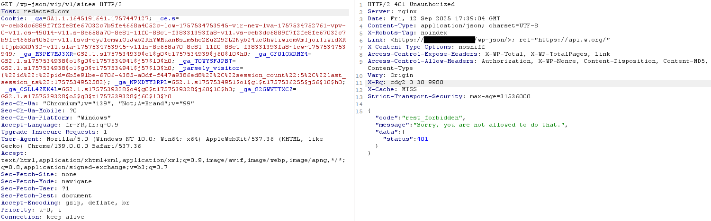
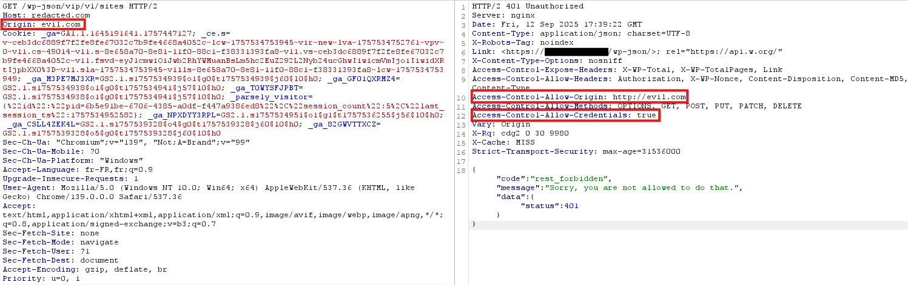
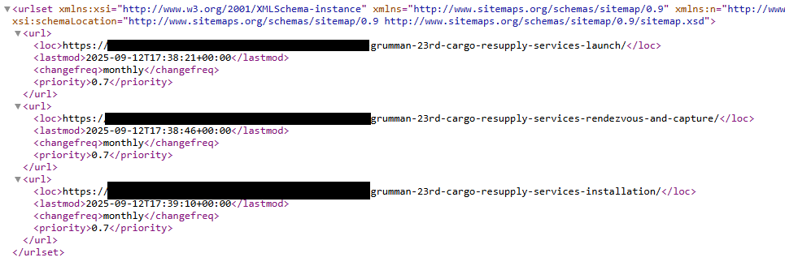
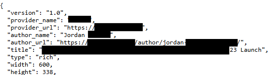
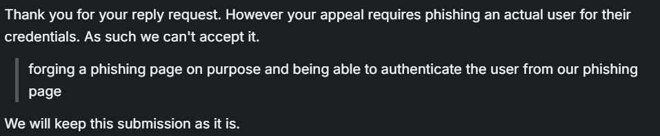

# CORS Policy Flaw Leading to High-Risk Cross-Site Data Theft Exposure

## CORS Policy Flaw Discover
CORS Policies are server-side configurations that allow whitelisting of known sites/domains to send requests to servers.This configuration is well known to developers, because it requires absolute knowledge of the data flow, where it starts step by step. This leads to misconfigurations. 

Here, the 2 headers that interest us are:
- ```Access-Control-Allow-Origin``` which is the response headers that indicate the domains that can make requests
- ```Access-Control-Allow-Credentials``` which is the response headers which if equal to ```true``` authorizes the request from the origin server to authenticate a user or account from a cookie or another type of authentication (basic, jwt, ...)

Now to test if these 2 headers are vulnerable, we will make a simple GET/POST request to an endpoint that seems interesting to us.

Default CORS Response:



CORS Response when add ```Origin: evil.com```:



What we observe here is a ```Reflected Origin```, because the ```Origin``` that we added arbitrarily was found in the headers of the response and made the second header that interests us appear.

The risk with this behavior is that an outsider could create a phishing page on the final site, trick a user into entering their credentials into thinking they are on the correct login page, and then forward the request to the real server with it, so the user will not think they have been tricked.

To test this, Coffinxp a great researcher share in github, one tiny simple page to demonstrate the CORS Flaw, you will find code here: [CorsExploit](https://github.com/coffinxp/scripts/blob/main/CorsExploit.html)

Tips:
- To test many url you can use this nuclei template, made by Coffinxp too: [CORS Nuclei Template](https://github.com/coffinxp/nuclei-templates/blob/main/cors.yaml)

## User Enumeration Flaw Discover
Now that we have our way in, we need to find users who are likely to have a WordPress account and be able to do targeted phishing, which will increase the chances of having working credentials without raising the alarm by sending 800 emails.

To do this we will use the metadata available on the pages of a WordPress site.
To list the pages, there is no need to do it manually; we will directly draw on the website information, via the ```https://redacted.com/sitemap.xml``` file.

We will have a result like this:



Then we need to copy one of the links and concatenate it with another WordPress feature that allows us to see the metadata of an URL: ```https://redacted.com/wp-json/oembed/1.0/embed?url=https://redacted.com/```

Then we find a valid account name, in the field ```author_name```:



By doing this same step for each link available via the ```sitemap.xml```, we will be able to have a list of valid accounts, perhaps with first/last names allowing us to target the attack on these people.

## Chain Flaw

These two flaws, taken independently, do not have a very high degree of criticality, but chained together, we obtain a realistic and feasible attack to pass from visitor of a WordPress to admin of the WordPress. This drastically increases the severity of the findings because it answers questions: 
- What could an attacker do? 
- What would the consequences be?

## Why Bug Bounty Limitation ?
This flaw is present and poses a real threat to companies, but unfortunately it is not eligible for a bug bounty report, as it would require trapping a real user to demonstrate during the POC phase. Despite the multiple paragraphs explaining the case on a target redacted.com, this flaw is indeed present and could allow an attacker or a redteamer to gain admin access on WordPress and unlock access to new endpoints.

Triage team's message:




## Disclaimer
Only meant for educational & ethical pentesting/bug hunting purposes with permission. You are responsible for your actions!